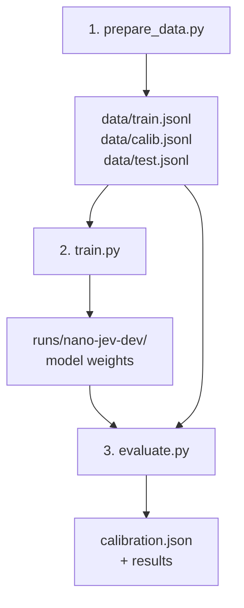

# Nano-Jev: How the Model is Trained

## What nano-jev actually is

Nano-jev is **not** a generative model. It's a **33M-parameter cross-encoder** that makes small, fast classification decisions for RAG pipelines. You give it a question + some options + context, and it returns a probability distribution over the options. It never outputs text.

It makes three kinds of decisions:

| Decision | Question template | Options | What it answers |
|---|---|---|---|
| `relevance` | "How relevant is this passage to the query: {query}" | irrelevant / partially relevant / directly answers | Is this passage useful? |
| `sufficient` | "Does the context contain enough information to answer: {query}" | yes / no | Do I have enough to answer? |
| `grounded` | "Is this claim supported by the context? Claim: {claim}" | yes / no | Is this answer actually supported? |

## Architecture

```
Input: "[CLS] question: {question} option: {opt} [SEP] {context} [SEP]"
                              │
                    ┌─────────▼─────────┐
                    │  MiniLM-L12-H384  │   (12 layers, hidden 384)
                    │   Cross-Encoder    │
                    └─────────┬─────────┘
                              │
                        1 logit per
                      (question, option)
                              │
                    ┌─────────▼─────────┐
                    │   Group by item    │   Collect logits for all options
                    │   + softmax / T    │   Temperature-scaled softmax
                    └─────────┬─────────┘
                              │
                   Probability per option
```

> [!IMPORTANT]
> Each option is scored **independently** as a separate (question+option, context) pair through the cross-encoder, producing 1 logit each. The logits for all options of the same decision are then grouped and softmaxed together. This means option order doesn't matter and new option sets work without retraining.

The base model for v1.0 is `microsoft/MiniLM-L12-H384-uncased` — a clean MIT-licensed model with no MS MARCO in its lineage.

## The Full Training Pipeline



### Step 1 — Data Preparation (`scripts/prepare_data.py`)

This script calls `nanojev.data.build_all()` which downloads three public datasets and converts them into typed-decision training examples:

**Datasets used:**

| Dataset | What it provides | How many (default preset) |
|---|---|---|
| **HotpotQA** (distractor) | `relevance` + `sufficient` examples | 6,000 questions → ~24,000 examples |
| **SQuAD 2.0** | `sufficient` examples | 6,000 examples |
| **MultiNLI** | `grounded` examples | 8,000 examples |

Total: **~49,760 training examples**

The output is three JSONL files where each line looks like:

```json
{
  "decision": "relevance",
  "question": "How relevant is this passage to the query: When was UCL founded?",
  "options": ["irrelevant", "partially relevant", "directly answers"],
  "state": "University College London: University College London was founded in 1826...",
  "label": 2,
  "source": "hotpot"
}
```

### How HotpotQA Becomes Training Examples

This is the key part for your project. Each HotpotQA question generates **~6 examples**:

#### Relevance examples (4 per question)

HotpotQA's distractor config gives 10 paragraphs per question: 2 gold (supporting) + 8 distractors. The code uses this structure:

| Paragraph type | Label | Reasoning |
|---|---|---|
| Gold paragraph **containing the answer string** | `directly answers` (2) | The passage has the literal answer |
| Gold paragraph **without the answer string** | `partially relevant` (1) | It's needed for reasoning but doesn't directly contain the answer |
| Distractor paragraph (2 randomly sampled) | `irrelevant` (0) | Unrelated to the question |

The code in [`nanojev/data.py`](file:///tmp/nano-jev/nanojev/data.py#L46-L61):
```python
for t in gold:
    has_answer = ans not in ("yes", "no") and ans in paras[t].lower()
    label = 2 if has_answer else 1  # directly answers vs partially relevant
    # state = the paragraph text

for t in rng.sample(distract, 2):
    label = 0  # irrelevant
```

#### Sufficiency examples (2 per question)

The model needs to learn whether a set of passages is **enough** to answer a question:

| Passage set | Label | Why |
|---|---|---|
| Both gold paragraphs + 1 distractor | `yes` (0) | All supporting evidence is present |
| 1 gold paragraph + 2 distractors | `no` (1) | Missing one required hop |

> [!TIP]
> Both sets have **the same number of passages** (3). This prevents the model from learning a shortcut based on passage count — it has to actually evaluate the content.

### Step 2 — Training (`scripts/train.py`)

The training loop is straightforward fine-tuning:

| Hyperparameter | Value (v1.0) |
|---|---|
| Optimizer | AdamW |
| Learning rate | 5e-5 (v1.0) / 3e-5 (default in script) |
| Weight decay | 0.01 |
| Batch size | 16 examples (each example has 2-3 option pairs) |
| Epochs | 2-3 (best epoch kept by dev NLL) |
| Warmup | 6% of total steps, then linear decay |
| Precision | bfloat16 on CUDA |
| Gradient clipping | max norm 1.0 |
| Hardware | 1× RTX 3060, ~13.5 min/epoch |

**Loss function:** Standard cross-entropy on the grouped logits.

```python
# Per batch:
logits = group_logits(model, enc, g, p, len(labels))  # [batch, max_options]
loss = cross_entropy(logits, labels)
```

**Model selection:** A dev set (1,500 examples sampled from the calibration split) tracks NLL each epoch. Only the best epoch is saved.

### Step 3 — Evaluation & Calibration (`scripts/evaluate.py`)

After training, the model's raw logits are not perfectly calibrated (i.e., a 70% confidence doesn't mean 70% accuracy). **Temperature scaling** fixes this:

1. **Fit** a single temperature `T` per decision type on `calib.jsonl` by minimizing NLL of `softmax(logits / T)` using L-BFGS
2. **Report** accuracy, macro F1, NLL, Brier score, and ECE on `test.jsonl` using those temperatures
3. **Save** `calibration.json` (the per-decision temperatures) alongside the model weights

v1.0 temperatures: `relevance=1.295`, `sufficient=1.347`, `grounded=1.381` — all slightly above 1, meaning the raw model is slightly overconfident.

## Data Split Strategy

```
HotpotQA train    ──────────────┐
SQuAD 2.0 train   ──────────────┤──→ train.jsonl
MultiNLI train    ──────────────┘

HotpotQA validation[0:500]  ────┐
SQuAD 2.0 validation (half) ────┤──→ calib.jsonl  (temperature fitting)
MultiNLI validation  (half) ────┘

HotpotQA validation[500:1000] ──┐
SQuAD 2.0 validation (half) ────┤──→ test.jsonl   (reporting)
MultiNLI validation  (half) ────┘

MuSiQue dev (never trained on) ─┐
VitaminC test (never trained on)┘──→ data_heldout/test.jsonl  (generalisation)
```

> [!NOTE]
> The HotpotQA validation split is divided by **question index** (not by example), so all examples from the same question stay in the same split. This avoids leakage.

## How Inference Works

At inference time ([`nanojev/decider.py`](file:///tmp/nano-jev/nanojev/decider.py)):

1. For each option in the decision, construct a pair: `"question: {question} option: {opt}"` + `"{context}"`
2. Tokenize all pairs (truncate context to fit 512 tokens)
3. Forward pass through the cross-encoder → 1 logit per pair
4. Group logits by item, apply temperature scaling, softmax → calibrated probabilities

A typical RAG loop uses it like:
```
retrieve → relevance filter → sufficiency check → LLM generate → groundedness check
```

## Key Takeaways

1. **It's a classifier, not a generator.** No text generation means no hallucinated formats or malformed outputs — just probabilities.
2. **HotpotQA's multi-hop structure is the backbone.** The 2-gold + 8-distractor setup naturally creates relevance labels, and the 2-hop reasoning creates sufficiency labels.
3. **Three datasets, three decision types.** HotpotQA→relevance+sufficient, SQuAD 2.0→sufficient, MultiNLI→grounded. Each dataset's structure maps cleanly to one or two decision types.
4. **Temperature calibration is a separate post-training step**, fitted on held-out data, not during training.
5. **The model is tiny and fast** (~1-4ms per decision on GPU, ~17ms on CPU) because it uses MiniLM with only 33M parameters.
